<h1>GitHub IssueOps Actions Importer</h1>

<a id="readme-top"></a>

The GitHub IssueOps Action Importer repository demonstrates the functionality necessary to run GitHub Actions Importer commands through Actions and Issues, allowing a user to migrate their CI/CD workflows without needing to install software on their local machine. This approach is especially useful for organizations that want to enable self-service migrations to GitHub Actions.

The issueops repository serves as the foundation for all CI tools like Jenkins, GitLab, CircleCI, Azure DevOps, and Travis CI. It is important to note that this toolset It is recommended to set up this repository to migrate existing pipelines to GitHub Actions workflows.

The instructions provided below will walk the user through how to set up the repository to prepare for migration, execute the migration leveraging IssueOps, and steps to assist in post-migration validation. Before getting started, users should review the Prerequisite section below to validate they have everything they need to get started.

<!-- TABLE OF CONTENTS -->

  <summary><h3>Table of Contents</h3></summary>
  <ol>
    <li>
      <a href="#about-the-project">About The Project</a>
      <ul>
        <li><a href="#built-with">Built With</a></li>
      </ul>
    </li>
    <li>
      <a href="#getting-started">Getting Started</a>
      <ul>
        <li><a href="#prerequisites">Prerequisites</a></li>
        <li><a href="#installation">Installation</a></li>       
      </ul>
    </li>
    <li><a href="#usage">Usage</a>
     <ul>
       <li><a href="#customizing-repository-for-migration">Customizing repository for migration</a></li>
       <li><a href="#advanced-customization-for-gitlab">Advanced Customization for GitLab</a></li>
       <li><a href="#workflow-logs-in-the-issueops-repository">Workflow Logs in the IssueOps repository</a></li>
     </ul>
    </li>
    <li><a href="#contact">Contact</a></li>
  </ol>

<!-- About the Project -->

### About the Project

The purpose of IssueOps Action Importer repository is to utilize the GitHub Actions Importer tool to import existing continuous integration (CI) or continuous deployment (CD) pipelines from other platforms into GitHub Actions. By performing this activity, users can take advantage of the powerful features and flexibility offered by GitHub Actions for their CI/CD workflows.

Migrating CI/CD pipelines to GitHub Actions using the Importer tool offers several benefits. First, it centralizes development and deployment processes within the GitHub ecosystem, allowing for better collaboration and streamlined workflows. GitHub Actions provides a wide range of built-in actions and integrations, enabling the automation of various tasks and customization of pipelines to meet specific requirements. Additionally, GitHub Actions offers seamless integration with other GitHub features such as pull requests, issues, and repositories, enhancing the overall development experience.

Upon successfully importing existing CI/CD pipelines to GitHub Actions, a user can harness the power of GitHub Actions for their CI/CD pipelines; enhancing automation, collaboration, and efficiency in the software development lifecycle.

<!-- Built With -->

### Built With

- <a href="https://github.com">Github</a>
- <a href="https://github.com/marketplace">Github Marketplace</a>
- <a href="https://docs.github.com/en/actions">GitHub Actions</a>
- <a href="https://docs.github.com/en/actions/migrating-to-github-actions/automated-migrations/automating-migration-with-github-actions-importer">GitHub Actions Importer</a>
- <a href="https://github.com/actions/importer-issue-ops">Github Actions Importer Issueops</a>

<!-- GETTING STARTED -->

## Getting Started

### **Prerequisites**

1. A Personal Access Token (PAT) will be required so that requesting repositories can interact with the IssueOps repository. The creator of the PAT should be a GitHub Organization owner and create a secret at the organization level to store the PAT. On GitHub, create a personal access token (PAT) with the following scopes (for assistance on how to create a PAT, check out this [article](https://docs.github.com/en/authentication/keeping-your-account-and-data-secure/creating-a-personal-access-token)):

   - repo
   - workflow
   - admin:org
   - admin:repo_hook
   - admin:org_hook

2. A GitHub repository will be necessary to store the IssueOps repository. This repository will be used to run the GitHub Actions Importer commands. This repository must exist in the Organization with the repos that are importing the pipelines.

3. Make sure you have full access to this repository, if not please work with the Organization and/or Repository owner to gain the proper access.

<p align="right">(<a href="#readme-top">back to top</a>)</p>

### **Installation**

1. Login into Github

   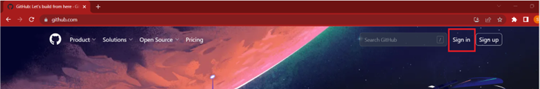

2. Provide username and password when prompted

   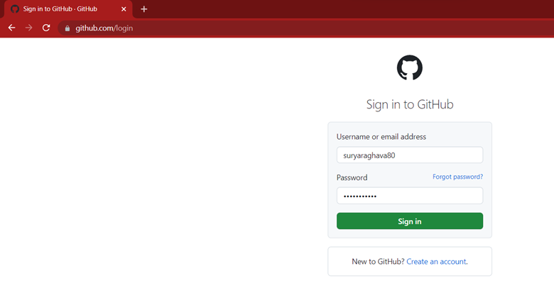

3. Open below link in new tab

   <https://github.com/actions/importer-issue-ops>

   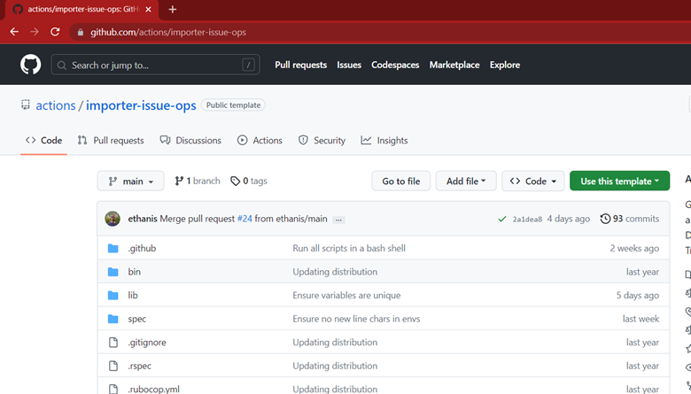

4. Click on "Use this template" and select "Create a new repository" from the options.

   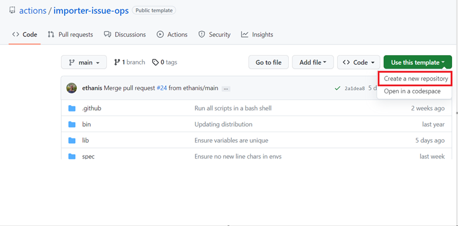

5. Set up the repository in the following manner:

   - Select the organization name under "Owner" (select the organization where the migration activity will occur.)
   - Provide the repository name(user's choice, here its "my-issue-ops")
   - Select the visibility scope of project(Public, Internal, Private), Private is highly recommended.
   - Click on "Create repository from template". It will take a few moments for the repository to copy over. Upon completion, the repository copy is now set up and the user can move onto the next section: [Customizing repository for migration](#customizing-repository-for-migration)

   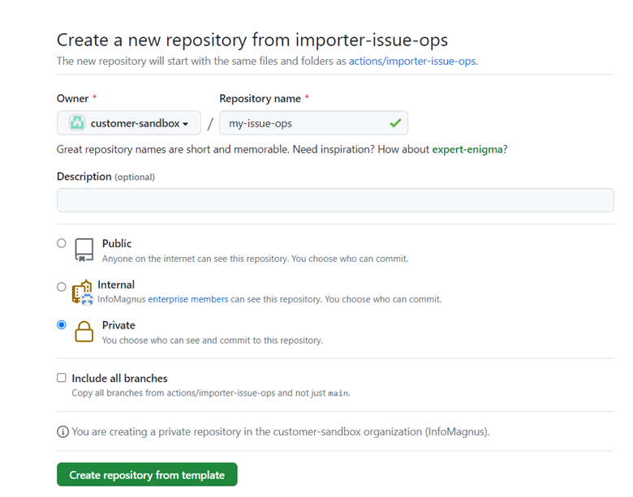

<p align="right">(<a href="#readme-top">back to top</a>)</p>

<!-- USAGE EXAMPLES -->

## Usage

### **Customizing repository for migration**

1. To make the repository work for both small and large migrations, some modifications are required. Here are a few suggested changes
2. In the cloned repository from above step([Installation](#installation)), navigate to **.github/workflows/issue_ops.yml**

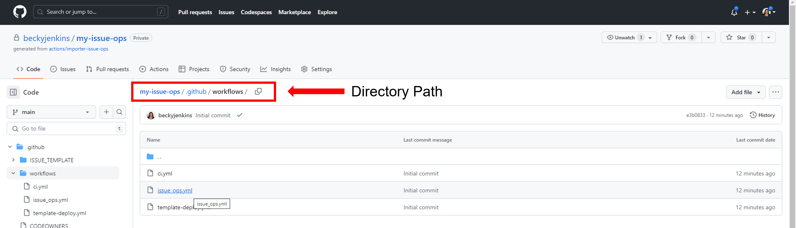

3. Open the YML file in edit mode

   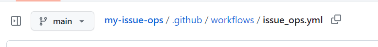

   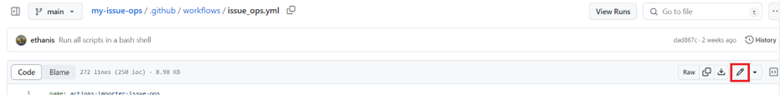

4. Replace the Jenkins instance URL environment variable value from `${{ secrets.JENKINS_INSTANCE_URL }}` with `${{ vars.JENKINS_INSTANCE_URL }}`. This change involves updating the reference from the secrets context to the vars context.
   | Before modification | After modification |
   | ---------------------- | ---------------------- |
   | 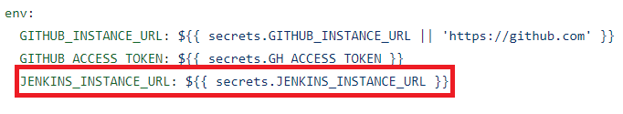 | 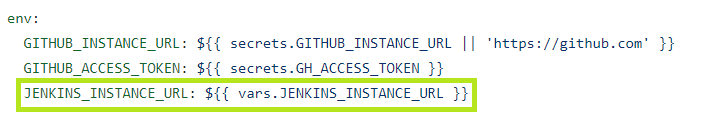 |

5. The next step is to change the environment variable `GH_TOKEN` under the execute-actions-importer job. Update it from `GH_TOKEN: ${{ github.token }}` to `GH_TOKEN: ${{ secrets.ISSUE_OPS_ACTION_IMPORTER_TOKEN }}`.

   | Before modification         | After modification          |
   | --------------------------- | --------------------------- |
   | 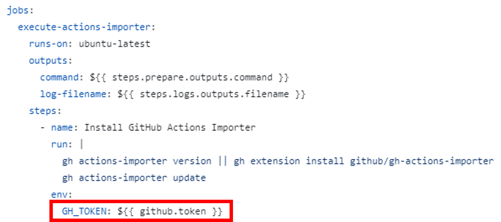 | 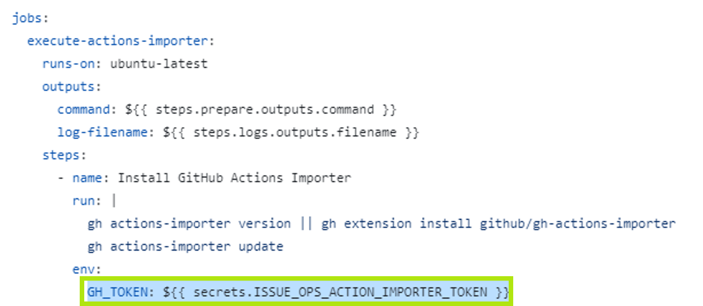 |

6. Review your changes and click on commit

   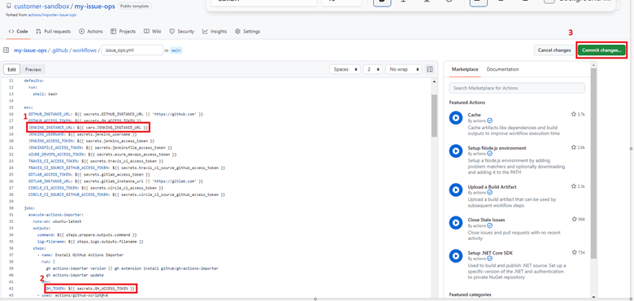

7. Finally, a secret will need to be created at the Organization level for ISSUE_OPS_ACTION_IMPORTER_TOKEN. To do this, navigate to the Organization and click on "Settings" tab. 

 **Note**: This step requires administrative level permission for the Organization. If user does not have this level of access, they should work with the Organization administrator to complete this step.

   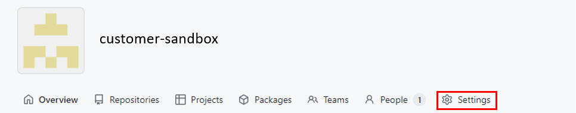

8. Under "Security" on the menu to the left, click on "Secrets and variables" and then click on "Actions"

   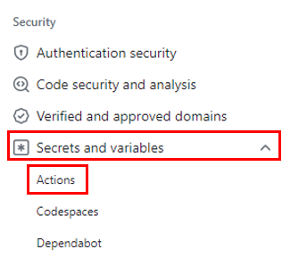

9. Click on "New organization secret"

   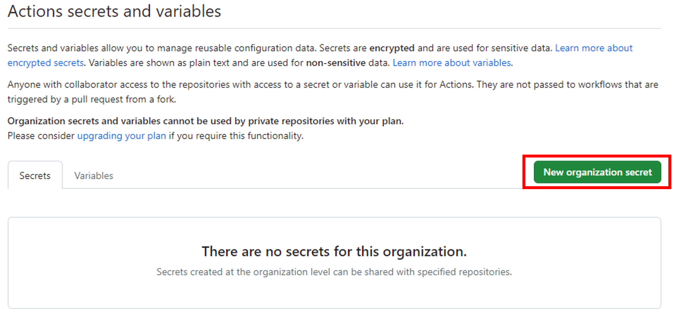

10. Name the secret ISSUE_OPS_ACTION_IMPORTER_TOKEN and copy/paste value created from PAT in Value. Click on add secret.

   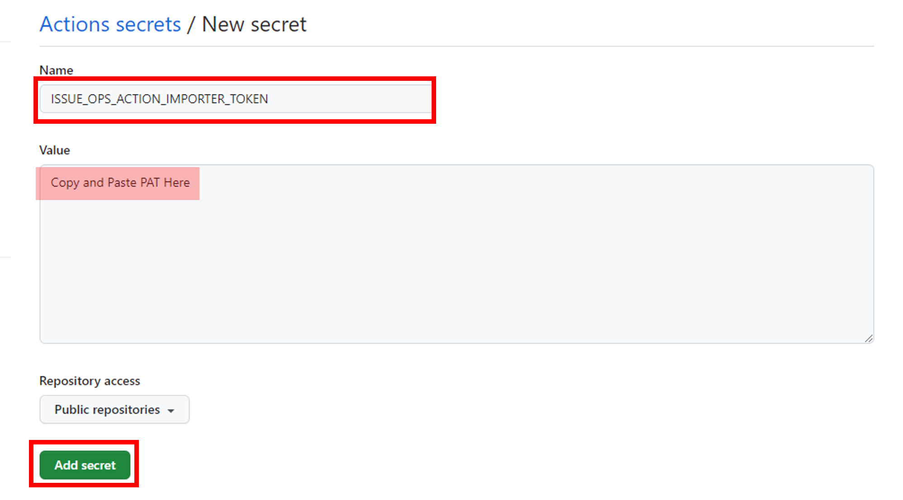

**Notes**: 
  - If a PAT doesn't exist, one can be created by following these instructions [here](https://docs.github.com/en/authentication/keeping-your-account-and-data-secure/creating-a-personal-access-token) 
  - This is a one-time setup for migrations involving Jenkins and GitLab. The same token, ISSUE_OPS_ACTION_IMPORTER_TOKEN, updated above in the issueops organization, can also be used for GitLab. 

11. Organization & initial support repository setup is complete for Jenkins. Migration users can now begin setting up the IssueOps Action Importer that will be used for migrations. [Click Here](/pipeline-migration/Issue-ops-setup/IssueOps-Migration-Tool.md) to move onto IssueOps Action Importer setup.

**Note**: _If you are migrating GitLab pipelines to GitHub Actions workflows, there are a few file changes you need to make. However, if you are only migrating Jenkins pipelines, you can skip the section titled [Advanced Customization for GitLab](#advanced-customization-for-gitLab)_

<p align="right">(<a href="#readme-top">back to top</a>)</p>

<!-- Advanced-Customization-for-GitLab -->

### **Advanced Customization for GitLab**

1. These steps are required to prepare for a migration from GitLab to GitHub Actions Workflow. There are few modifications required in files, which are detailed in this section. However, if you are only migrating Jenkins pipelines, you can skip this section.

2. Navigate to the repository created above, click on "Code".

   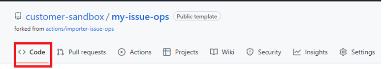

3. Navigate to this path lib/models/gitlab_ci and you would see the below files which require a change for gitlab

   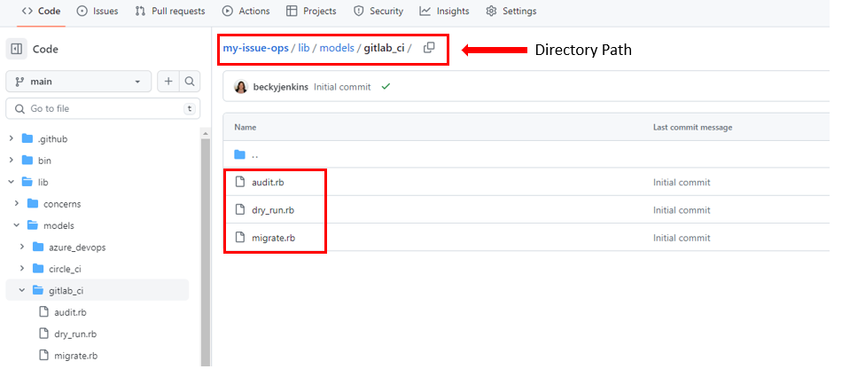

4. Click on **audit.rb** file and open in edit mode.

   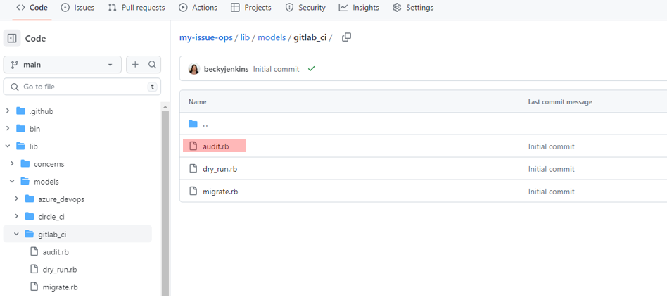
   
   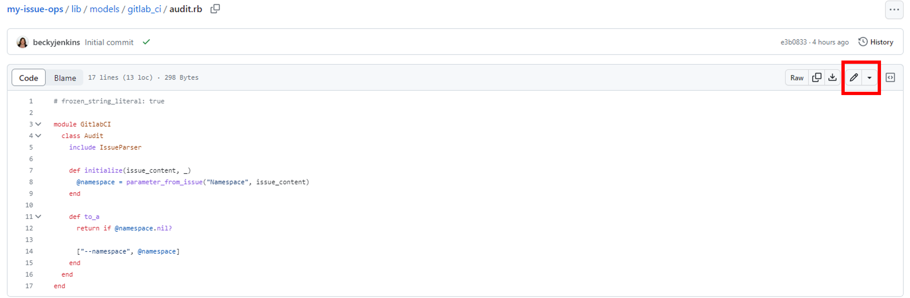

5. Copy the code below and use it to replace the default code from the **audit.rb** file. 
   ```js
   # frozen_string_literal: true

   module GitlabCI
     class Audit
       include IssueParser

       def initialize(issue_content, command)
         @namespace = command.options["namespace"]
       end

       def to_a
         args = []
         args.concat(["--namespace", @namespace]) unless @namespace.nil?

         return args unless args.empty?
       end
     end
   end
   ```

6. Review and commit the changes.

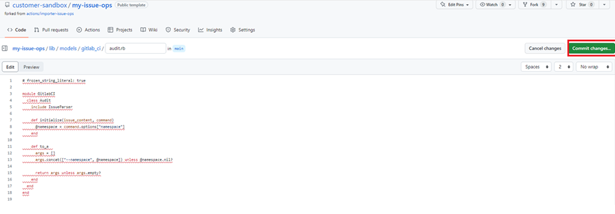

7. Navigate back to the gitlab_ci folder at this path lib/models/gitlab_ci. 


8. Open the dry run file(lib/models/gitlab_ci/dry_run.rb) in edit mode. 

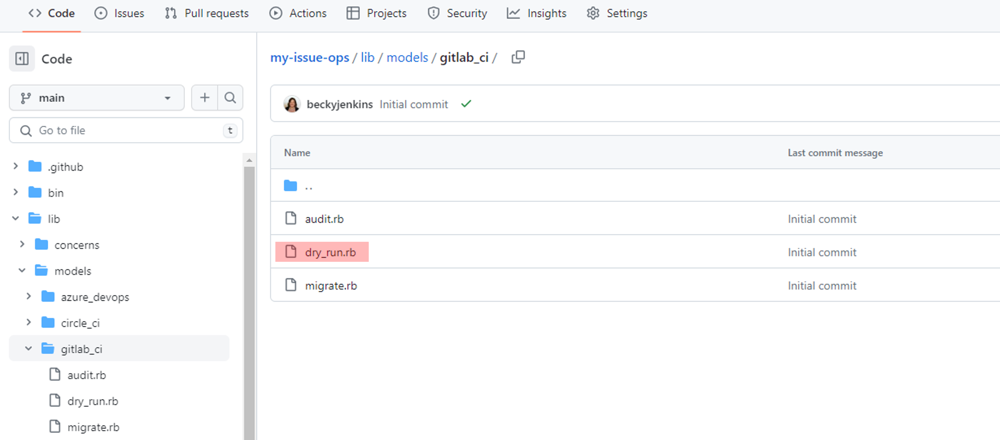

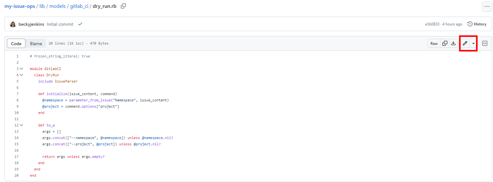

9. Copy the code below and add it after "project" parameters.
   ```javascript
   @namespace = command.options["namespace"]
   ```

10.  Once modified it should look like this:

   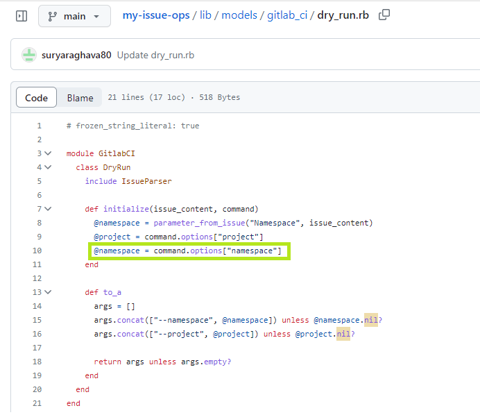

11. Review and commit the changes.

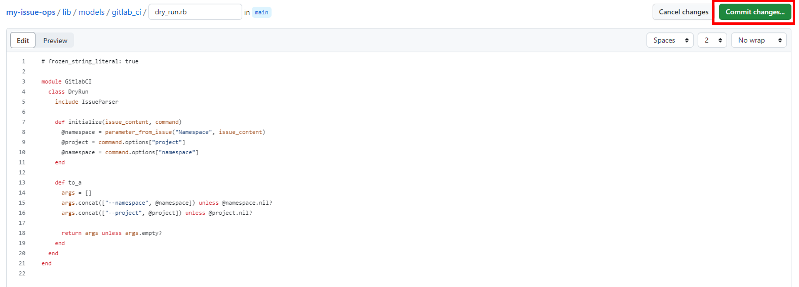

12. Navigate back to the gitlab_ci folder at this path lib/models/gitlab_ci. 


13. Open the migrate file(lib/models/gitlab_ci/migrate.rb) in edit mode 

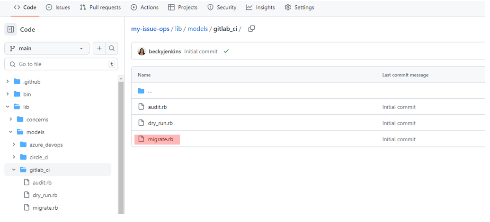

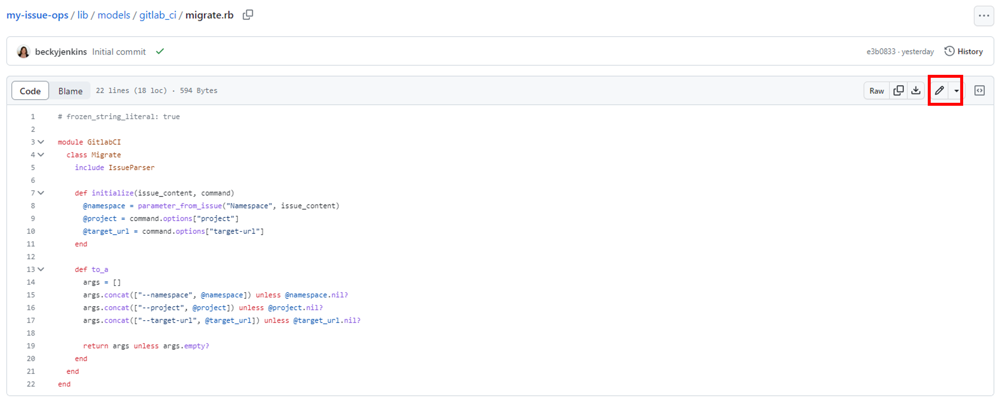


14. Copy the line of code below and add after "target_url"

   ```javascript
   @namespace = command.options["namespace"]
   ```

 15. Once modified, it should look like this:

   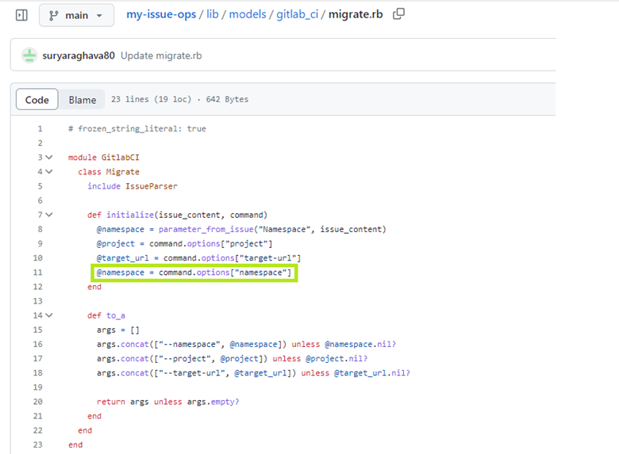
   
 16. Review and commit the changes
 
 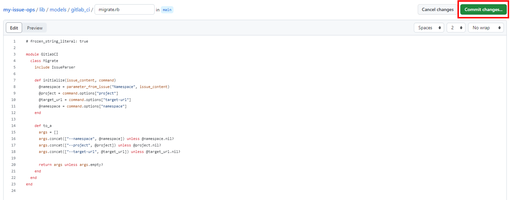
 
 17. GitLab setup is now complete and users can begin migration activity by following the instructions located here: [IssueOps-Migration-Tool](/pipeline-migration/Issue-ops-setup/IssueOps-Migration-Tool.md)

<p align="right">(<a href="#readme-top">back to top</a>)</p>

<!-- CONTACT -->

## Contact

Your Name - 

Project Link: 

<p align="right">(<a href="#readme-top">back to top</a>)</p>
```
