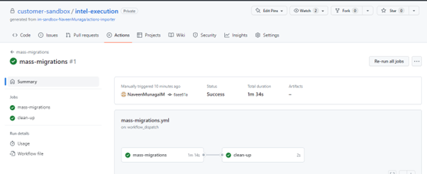

<h1>Migrating Pipelines Via IssueOps</h1>

<a id="readme-top"></a>

The GitHub Migration IssueOps repository demonstrates the functionality necessary to migrate pipelines via GitHub Issues, allowing a user to migrate their CI/CD workflows without needing to install software on their local machine. This approach is especially useful for organizations that want to enable self-service migrations to GitHub Actions.

The issueops repository serves as the foundation for all CI tools like Jenkins, GitLab, CircleCI, Azure DevOps, and Travis CI. It is recommended to set up this repository to migrate existing pipelines to GitHub Actions workflows.

The instructions provided below will walk the user through execution of a migration leveraging IssueOps, and steps to assist in post-migration validation. Before getting started, users should review the Prerequisite section below to validate they have everything they need to get started.

<!-- TABLE OF CONTENTS -->

  <summary><h3>Table of Contents</h3></summary>
  <ol>
    <li>
      <a href="#about-the-project">About The Project</a>
      <ul>
        <li><a href="#built-with">Built With</a></li>
      </ul>
    </li>
    <li>
      <a href="#getting-started">Getting Started</a>
      <ul>
        <li><a href="#prerequisites">Prerequisites</a></li>
        <li><a href="#installation">Installation</a></li>       
      </ul>
    </li>
    <li><a href="#usage">Usage</a>
     <ul>
       <li><a href="#adding-an-issue-in-the-issueops-repo">Adding an issue in the IssueOps repository - Including Setup of Repository</a></li>
       <li><a href="#adding-an-issue-in-the-issueops-repo">Adding an issue in the IssueOps repository - Migrating into an Existing Repository</a></li>
       <li><a href="#large-migrations-using-action-workflow">Migrations using action workflow</a></li>
       <li><a href="#workflow-logs-in-the-issueops-repository">Workflow Logs in the IssueOps repository</a></li>
     </ul>
    </li>
    <li><a href="#contact">Contact</a></li>
  </ol>

<!-- About the Project -->

### About the Project

The purpose of Issueops repository is to utilize the GitHub Actions Importer tool to import existing continuous integration (CI) or continuous deployment (CD) pipelines from other platforms into GitHub Actions. By performing this activity, users can take advantage of the powerful features and flexibility offered by GitHub Actions for their CI/CD workflows.

Migrating CI/CD pipelines to GitHub Actions using the Importer tool offers several benefits. Firstly, it centralizes development and deployment processes within the GitHub ecosystem, allowing for better collaboration and streamlined workflows. GitHub Actions provides a wide range of built-in actions and integrations, enabling the automation of various tasks and customization of pipelines to meet specific requirements. Additionally, GitHub Actions offers seamless integration with other GitHub features such as pull requests, issues, and repositories, enhancing the overall development experience.

Upon successfully importing existing CI/CD pipelines to GitHub Actions, a user can harness the power of GitHub Actions for their CI/CD pipelines; enhancing automation, collaboration, and efficiency in the software development lifecycle.

### Built With

- <a href="https://github.com">Github</a>
- <a href="https://github.com/marketplace">Github Marketplace</a>
- <a href="https://docs.github.com/en/actions">GitHub Actions</a>
- <a href="https://docs.github.com/en/actions/migrating-to-github-actions/automated-migrations/automating-migration-with-github-actions-importer">GitHub Actions Importer</a>
- <a href="https://github.com/actions/importer-issue-ops">Github Actions Importer Issueops</a>

<!-- GETTING STARTED -->

## Getting Started

### **Prerequisites**

1. A Personal Access Token (PAT) will be required so that requesting repositories can interact with the IssueOps repository. The creator of the PAT should be a GitHub Organization owner and create a secret at the organization level to store the PAT. On GitHub, create a personal access token (PAT) with the following scopes (for assistance on how to create a PAT, check out this [article](https://docs.github.com/en/authentication/keeping-your-account-and-data-secure/creating-a-personal-access-token)):

   - repo
   - workflow
   - admin:org
   - admin:repo_hook
   - admin:org_hook

2. Create a GitHub repository to store the issueops Actions Importer. For instructions on how to set up the issueops Actions Importer, see this link: [IssueOps Action Importer Setup](./Issue-ops-setup/Actions-Importer-Issue_Ops%20Repository%20Setup.md). This repository will be used to run the GitHub Actions Importer commands. This repository must exist in the Organization with the repos that are importing the pipelines.

****************************
** No, I don't think this is correct, if the intent is that the person requesting the import needs full access to the issueops Action Importer. If the intent is the person needs full access to the repo where the pipelines will be imported, then this is correct. Needs clarification on which repo is referenced
**********************************************
3. Make sure you have full access to repository,if not please reach out to repo or org owner for providing you access.

### **Adding an issue in the IssueOps repository - Including Setup of Repository**

Use these instructions if a repository for the migrated workflow has not yet been established. For migrations into existing repositories, see Adding an Issue in the IssueOps Repository - Migrating into an Existing Repository.

1. Using the template <*this repo*>, Create a new repo. Click on "Use this template" and select "Create a new repository" from the options. Fill the following details:

   - First select the organization name under "Owner" (select the organization where the migration activity will occur.)
   - Provide the repository name(user's choice")
   - Select the visibility scope of project(Public, Internal, Private), Private is highly recommended.
   - Finally, click on "Create repository from template". It will take a few moments for the repository to copy over. Upon completion, the repository copy is now set up and the user can move onto the next step.

   

   

2. A new repository will be created as shown below.

   

3. Now go to "Actions" tab, under "All workflows" click on `"add-migration-issue"` workflow.

   

4. Need to select or enter details for below and then click on the "Run Workflow" button.

   - **Use workflow from** - Provide the branch name from where the workflow should be triggered, here it's "main".
   - **CI/CD tool** - Select the CI/CD tool from the available options (Jenkins, GitLab, CircleCI, TravisCI) for which the issue needs to be created in the IssueOps repository.Here I have selected "Jenkins".

     

   * As I selected "Jenkins", the same issue with Jenkins template will be created at IssueOps repository as seen below.
     

5. The relevant `"issue_id"` will be created in the current repository, variable with the name `"JENKINS_ISSUE_ID"`, which will be later used by the mass-migrations workflow(s) to perform migrations by adding comments to this particular `"Issue_id"` in the issuesops Action Importer repo.

   
     
### **Adding an issue in the IssueOps repository - Migrating into an Existing Repository**

Use these instructions if a repository for the migrated workflow is already established. For migrations where the repository has not yet been established, see Adding an Issue in the IssueOps Repository - Including Setup of Repository.

1. Navigate to the repository that pipelines will be migrated to.

2. Now go to "Actions" tab, under "All workflows" click on `"add-migration-issue"` workflow. As it was set as a workflow_dispatch, it needs to be manually triggered.

   

3. Select or enter details as outlined below and then click on the "Run Workflow" button.

   - **Use workflow from** - Provide the branch name from where the workflow should be triggered, in this example, it's "main".
   - **CI/CD tool** - Select the CI/CD tool from the available options (Jenkins, GitLab, CircleCI, TravisCI) for which the issue needs to be created in the IssueOps repository. In this example, it's "Jenkins".

     

   * Since "Jenkins" was selected above, the same issue with Jenkins template will be created at IssueOps repository as seen below.
     

4. The relevant `"issue_id"` will be created in the current repository, variable with the name `"JENKINS_ISSUE_ID"`, which will be later used by the large-migrations workflow(s) to perform migrations by adding comments to this particular `"Issue_id"`.

   

### **Migrations using action workflow**

1.  After creating the corresponding Issue for migrating a pipeline (example:Jenkins,) run the migrations workflow.
2.  Before running it, user must confirm the following steps have been taken:

    - In the repository that will get the pipeline migrated to, set the corresponding access token (PAT) in the Repository Secrets.
    - The naming convention to be followed is <IssueType>_ACCESS_TOKEN. For example, the Issue created for pipelines migrations is "JENKINS". So, the name for the Jenkins PAT would be "JENKINS_ACCESS_TOKEN".

      

    - Create the "config.json" file (with the details of the source and targets) in the config folder. 
  Use the config file with the mass-migration workflow. Technically, this will allow multiple sources to be migrated to multiple target repositories. To ensure a smooth migration, limit the target to be only the repository that is requesting the migration.
  There are three primary sections in the JSon file. These correspond to the instrustions that the issueops Action Importer will execute. There are 'migration', 'audit', and 'dry-run.' Each of these sections are updated with the required information that the issue-ops Action Importer needs to execute the commands.
  
  Other entries in the Json:
  * target_url: The url of your Github repository that will be updated with imported pipelines
  * jenkins_instance_url: The url to a Jenkins instance that has the pipelines that will be imported. Note: The token that is needed to authorize to Jenkins needs to be in the target repo as a JENKINS_ACCESS_TOKEN.
  * jenkins_username: user name that corresponds the the JENKINS_ACCESS_TOKEN.
  * gitlab_instance_url: The url to a Gitlab instance that has the pipelines that will be imported. Note: The token that is needed to authorize to Gitlab needs to be in the target repo as a GITLAB_ACCESS_TOKEN.
  * sources: contains entries for each instance of a pipeline that will be imported. Will contain the source type, and the full URL of the pipeline to be migrated.
  
  The sample config.json file is as follows:

      ```JSON
      {
         "migration": [
            {
               "target_url": "https://your-target-url1.com",
               "jenkins_instance_url": "https://your-jenkins-instance1.com",
               "jenkins_username": "your-jenkins-username",
               "gitlab_instance_url": "https://your-gitlab-instance1.com",
               "sources": [
                  {
                     "type": "jenkins",
                     "source_url": "https://your-jenkins-instance1.com/job/your-pipeline-name1"
                  },
                  {
                     "type": "jenkins",
                     "source_url": "https://your-jenkins-instance1.com/job/your-pipeline-name2"
                  }
               ]
            },
            {
               "target_url": "https://your-target-url2.com",
               "jenkins_instance_url": "https://your-jenkins-instance1.com",
               "jenkins_username": "your-jenkins-username",
               "gitlab_instance_url": "https://your-gitlab-instance1.com",
               "sources": [
                  {
                     "type": "gitlab",
                     "source_url": "your-gitlab-project1,your-gitlab-namespace1"
                  },
                  {
                     "type": "gitlab",
                     "source_url": "your-gitlab-project1,your-gitlab-namespace2"
                  }
               ]
            }
         ],
         "audit": [
            {
               "jenkins_instance_url": "https://your-jenkins-instance1.com",
               "jenkins_username": "your-jenkins-username",
               "gitlab_instance_url": "https://your-gitlab-instance1.com",
               "sources": [
                  {
                     "type": "jenkins"
                  },
                  {
                     "type": "gitlab",
                     "source_url": "your-gitlab-project1,your-gitlab-namespace1"
                  },
                  {
                     "type": "gitlab",
                     "source_url": "your-gitlab-project1,your-gitlab-namespace2"
                  }
               ]
            }
         ],
         "dry-run": [
            {
               "jenkins_instance_url": "https://your-jenkins-instance1.com",
               "jenkins_username": "your-jenkins-username",
               "gitlab_instance_url": "https://your-gitlab-instance1.com",
               "sources": [
                  {
                     "type": "jenkins",
                     "source_url": "https://your-jenkins-instance1.com/job/your-pipeline-name1"
                  },
                  {
                     "type": "jenkins",
                     "source_url": "https://your-jenkins-instance1.com/job/your-pipeline-name2"
                  },
                  {
                     "type": "gitlab",
                     "source_url": "your-gitlab-project1,your-gitlab-namespace1"
                  },
                  {
                     "type": "gitlab",
                     "source_url": "your-gitlab-project1,your-gitlab-namespace2"
                  }
               ]
            }
         ]
      }

      ```

  
  
  
After adding the config.json file it would look like this:


And config.json file will be seen as below:


- Here the target_url given is : `"https://github.com/customer-sandbox/target-execution"`
- The Jenkins source_url(s) are : `"http://20.51.238.66:8080/job/config-folders/job/environmentNonLiteral_config/"`,`"http://20.51.238.66:8080/job/config-folders/job/environmentInStage_config/"`

  Once the migration workflow runs successfully, a pull request with converted action pipeline will be created in the target repository for the two source Jenkins pipeLines.

3.  Next step would be to trigger the migrations workflow from Actions:

    - Navigate to "All workflows" and select "mass-migrations" workflow from the list of workflows.
      

4.  Need to select or enter details for below and then click on the "Run Workflow" button.

    - **Use workflow from** - Provide the branch name from where the workflow should be triggered, here it's "main".
    - **CI/CD tool** - Select the CI/CD tool from the available options (Jenkins, GitLab, CircleCI, TravisCI) for which the issue needs to be created in the IssueOps repository.Here I have selected "Jenkins".
    - **Import step** - Select "migration" from the options(audit, dry-run, migration).

      

5.  Once the workflow is triggered,

    - As the first step it will access the "migration_script.py" in the root folder where it contains the core logic to access the `"ISSUE_OPS_ACTION_IMPORTER_REPO"` value from the repository variables.
    - Now it will point to the Issue with the help of "JENKINS_ISSUE_ID" which was created as a part of [Adding an issue in the IssueOps repository](#adding-an-issue-in-the-issueops-repository) step.
    - Finally, adds the corresponding comments related to migration in it, which will automatically trigger the corresponding action workflow in the IssueOps Action Importer repository.

    - It will add the comments in the ISSUE in the IssueOps Action Importer as shown below

      

    - Workflow runs based on the comments and it shows as below

      

    - After completion of the workflow in the IssueOps Action Importer repository, the corresponding pull requests (PR) will be created in the target repository, and the issue in IssueOps Action Importer is updated as migration is successful. The user can review and merge the pipelines in the target repositories.

      
***************
  this cleaup routine needs to be reworked and instructions updated
  **************
    - The Issue will also be moved to closed state, once the mass-migration workflow is successfully completed.

      

6.  And the corresponding secrets and variables related to the Issue will be automatically cleaned up in the execution repository. Here it is "JENKINS_ACCESS_TOKEN" in Repository secrets and "JENKINS_ISSUE_ID" in Repository variables will be removed.After successful run of the workflow the Actions dashboard will look like:

    

7.  And after clean up the Repository secrets dashboard will look like:

    

8.  And after clean up the Repository variables dashboard will look like:

    

    **Note**: The time delay of 30 seconds is set between the adding of the comments for migration in Issue and a time delay of 15 seconds for audit and dry-run. This can always be adjusted in the code.

    - Sometimes the clean-up activity in the actions triggered in the IssueOps repository may fail as like this:

      

      but need not worry, if the migration job is successful. The corresponding pull requests will be created successsfully in the Issue and the user can review.

### **Workflow Logs in the IssueOps repository**

1. Go to Actions, under "All Workflows", select "WorkFlow Logs" action.

   

2. After selecting the "Workflow Logs", trigger the workflow by clicking on the "Run workflow" button.

   

3. Once the workflow triggers, it will access the `"ISSUE_OPS_ACTION_IMPORTER_REPO"` from repository variables and `"ISSUE_OPS_ACTION_IMPORTER_TOKEN"` from the repository secrets and gets the details of the workflow run(s) based on the respository variables or secrets. After completion of the run, click on the job and you will find a job with name "access-workflows" which should be successfully completed.

   

4. As shown below you will find detailed steps, click on the "Get Workflow Runs details" step.

   

5. This step will display the details like:
   title of the Job, the html url to access it, status, conclusion, created time, updated time, of the workflows that ran in the IssueOps Action Importer respository.

   

6. For now, it will display in the bash shell, if needed we can adjust the workflow to save the logs in file as `.csv` or `.txt` in the current execution respository or even we can trigger an email with all details.

<!-- CONTACT -->

## Contact

Your Name - <need to change to Customer internal contact\> [Infomagnus](https://www.infomagnus.com/infomagnus-and-github) - info@infomagnus.com

Project Link: [https://github.com/customer-sandbox/target-gh-actions](https://github.com/customer-sandbox/target-gh-actions)

<p align="right">(<a href="#readme-top">back to top</a>)</p>
```
