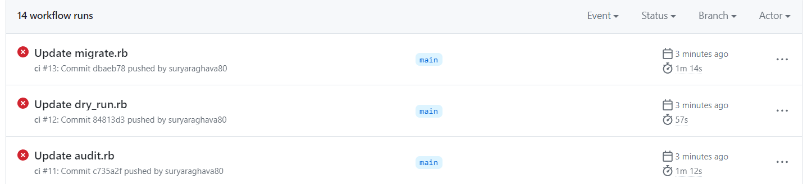

# **Troubleshooting Guide**

<!-- TABLE OF CONTENTS -->

  <summary><h3>Table of Contents</h3></summary>
  <ol>
    <li>
      <a href="#Known-Limitations">Known Limitations</a>
      <ul>
        <li><a href="#CICD Use Cases">CICD Use Cases</a></li>
      </ul>
        <li><a href="#Timing">CICD Timing</a></li>
      </ul>
    </li>
    <li>
      <a href="#common-issues">Common Issues</a>
      <ul>
        <li><a href="#naming-convention">Naming Convention</a></li>
        <li><a href="#IssueOps Server URL">IssueOps Server URL</a></li>       
        <li><a href="#Cleanup-Error-Fail-in-IssueOps-Repo">Cleanup Error Fail in IssueOps Repo</a></li>    
        <li><a href="#Options-For-Migrations-Workflows-Are_Not-Valid">Options For Migrations Workflows Are Not Valid</a></li>    
        <li><a href="#Scripted-Pipelines-Are-Not-Supported">Scripted Pipelines Are Not Supported</a></li>    
        <li><a href="#Unit-Test-Failures-For-GitLab">Unit Test Failures for GitLab</a></li>    
      </ul>
    </li>
  </ol>


<!-- Known-Limitations -->
### **Known Limitations**

When using this toolset, the following limitations should be taken into consideration and planned for accordingly.

**1. CICD Use Cases**

This solution works with the following CICD Tools:
  - Jenkins
  - GitLab
  
  **Note - This tool can be modified to work with other CICD toolsets, if so desired.**

<!-- Timing -->
**2. Timing**

Within any individual organization, this tool can only be used to migrate one user's pipelines at a time. A user may migrate multiple pipelines at once, but multiple users (working within the same Organization) cannot migrate like pipelines together. 

<!-- Common Issues -->
### **Common Issues**

<!-- Naming Convention -->
**1. Naming Convention**

To ensure a more consistent and maintainable naming convention, it's recommended to follow these guidelines:

1. Use uppercase letters instead of lowercase for secrets and variables.
2. Separate words using underscores (_) for secrets and variables.
3. Avoid repetition of similar names to prevent confusion among variables.

<!-- IssueOps Server URL -->
**2. IssueOps Server Url**

When mentioning the IssueOps server path as a variable, it's important to ensure that the URL is valid and doesn't contain any extra forward slashes ("/") at the end. Here's how you can communicate this:

Variable name: ISSUE_OPS_SERVER

Variable value: "organization/reponame"

Please ensure that the URL provided for the ISSUE_OPS_SERVER variable is a valid GitHub API endpoint for the IssueOps repository. It should not have any additional forward slashes ("/") at the end of the URL to avoid any potential issues.

<!-- Cleanup Error Fail in IssueOps Repo -->
**3. Cleanup Error Fail in IssueOps Repo**

Sometimes the clean-up activity in the actions triggered in the IssueOps repository may fail as like this:


As long as the migration job is completed successfully, this error can be disregarded. The corresponding pull requests will be created successsfully in the Issue and the user can review.

<!-- Options For Migrations Workflows Are Not Valid -->
**4. Options For Migrations Workflows are not valid**

Ensure that the options chosen for running the GitHub workflow should have relevant information in the config/config.json file. For Example If the import step of audit is selected, user must define specific relevant steps in Config.json.

 This file(config.json) serves as a configuration file for the workflow and should include the necessary settings and values based on the chosen options.

<!-- Scripted Pipelines Are Not Supported -->
 **5. Scripted pipelines are not supported**

 Currently, the actions importer does not support Jenkins scripted pipelines. If you encounter any errors like the one shown below while running the actions importer, it may be necessary to manually write the actions workflow. 

```javascript
# Unable to parse Jenkins pipeline. Scripted pipelines are not currently supported.
# Pipeline type: flow-definition
#Error: Process completed with exit code 1.
```
<!-- Unit Test Failures for GitLab -->
 **6. Unit Test Failures for GitLab**

 When we make custom changes to audit.rb, dry-run.rb, and migrate.rb for GitLab to work for our specific use case, it is possible that some of the unit test cases will fail when we manually modify and commit these files. There is no need to worry, as these changes do not affect the pipeline migration process. However, it is important to note that the unit test case for the issueops repository in GitLab will fail temporarily after these modifications are made. These failures will occur only once, at the time of modifying the files.


